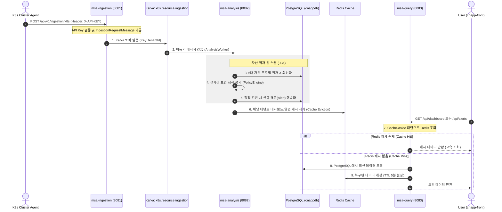
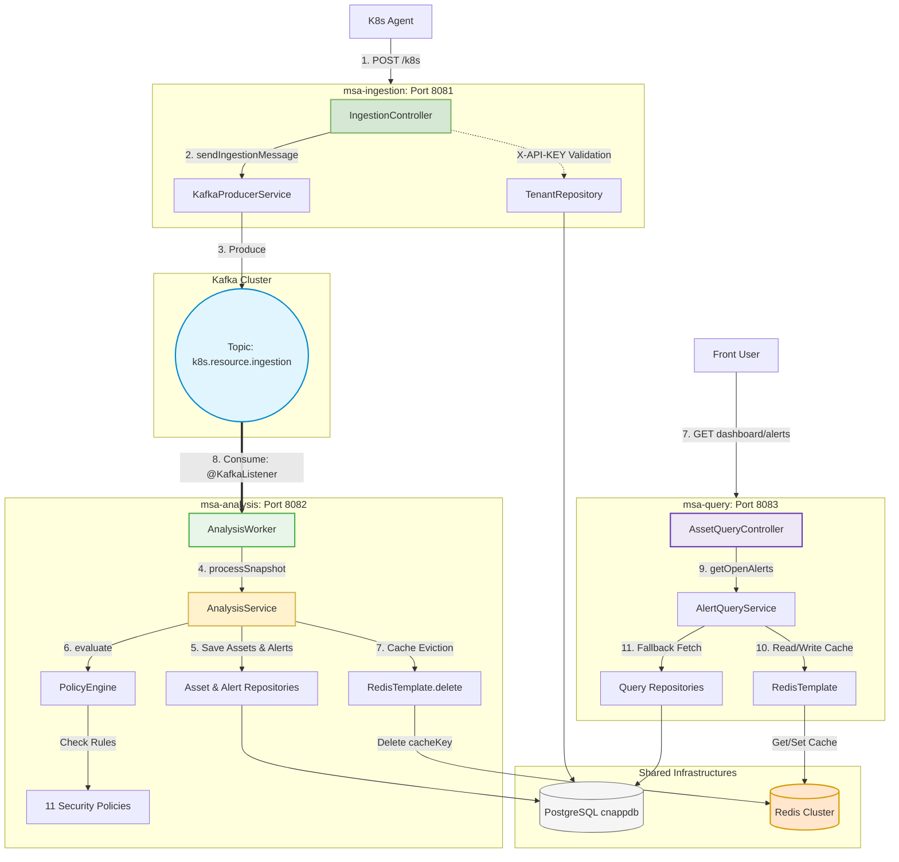

# K-Sentry MSA 마이그레이션 아키텍처 및 동작 메커니즘 분석

이 문서는 모놀리식 구조에서 분산형 마이크로서비스 아키텍처(MSA)로 전환된 K-Sentry `msa-version` 모듈의 내부 구조, 메시지 브로커(Kafka) 및 캐시(Redis) 연동 흐름, 그리고 CQRS 패턴 적용 방식에 대한 상세 분석 리포트입니다.

---

##  1. MSA 아키텍처 뷰 (Architecture Views)

### 1.1. [View A] MSA 전체 기능적 데이터 흐름 (Functional Data Flow)
에이전트로부터 수집된 정보가 Kafka 메시지 브로커를 거쳐 비동기 분석된 후, 캐시 무효화 과정을 거쳐 조회 API로 제공되기까지의 전체 시퀀스 흐름입니다.

---

### 1.2. [View B] 마이크로서비스 컴포넌트 아키텍처 (Detailed Microservices Topology)
각 마이크로서비스의 주요 컨트롤러, 서비스, 큐 프로듀서/컨슈머 관계와 공유 데이터베이스 연동 구조를 옆으로 나열하여 한눈에 볼 수 있도록 구성한 설계도입니다.

---

##  2. 마이크로서비스별 상세 역할 명세

K-Sentry 플랫폼의 MSA 전환을 통해 기존 모놀리식 서버의 복잡한 비즈니스 로직이 다음과 같이 4개의 전문 마이크로서비스로 분리되었습니다.

### 2.1. `msa-auth` (인증 및 정책 초기화 서비스)
* **주요 역할**: 테넌트 등록, API Key 발급, 사용자 JWT 로그인/회원가입, 테넌트 보안 정책의 활성화 상태 및 설정 파라미터 보관.
* **핵심 컴포넌트**:
  * [SignupApiController.java]: 회원 가입 및 고유한 `API Key` 발급.
  * [AuthPolicyService.java]: 신규 테넌트 생성 시 11종의 기본 보안 정책(`Policy`) 레코드를 데이터베이스에 초기화 및 세팅.

### 2.2. `msa-ingestion` (에이전트 수집 서비스)
* **주요 역할**: 쿠버네티스 보안 에이전트로부터 전달되는 raw JSON 리소스 스냅샷 데이터를 초경량 API로 수신하여, 이를 Kafka 브로커로 고속 위임.
* **핵심 컴포넌트**:
  * [IngestionController.java]: 에이전트가 요청 헤더로 보낸 `X-API-KEY`를 DB(`TenantRepository`)에서 1차 검증하고, 유효 시 공통 DTO `IngestionRequestMessage`를 생성.
  * [KafkaProducerService.java]: Kafka 토픽인 `k8s.resource.ingestion`으로 메시지를 전송. 이때 파티션 순서 보장을 위해 `tenantId`를 메시지 키로 설정.
  * *대용량 메시지 최적화*: `application.yml`의 `max.request.size`를 `10MB`로 확장하여 수메가 바이트 크기의 쿠버네티스 리소스 스냅샷 데이터 유실을 방지합니다.

### 2.3. `msa-analysis` (메시지 분석 및 보안 엔진 서비스)
* **주요 역할**: Kafka로부터 수집 메시지를 받아 자산 영속화(PostgreSQL 적재) 및 보안 탐지 평가를 연달아 비동기 수행하고, 처리 완료 시 캐시를 지우는 쓰기 전용 프로세스.
* **핵심 컴포넌트**:
  * [AnalysisWorker.java]: `k8s.resource.ingestion` 토픽의 컨슈머 그룹(`msa-analysis-group`)을 바인딩하여 백그라운드 메시지 소비 및 JSON 스냅샷 역직렬화 수행.
  * [AnalysisService.java]:
    1. **자산 적재**: 수신된 `ClusterSnapshot`을 분석하여 6대 핵심 자산(Pod, Node, Service, Deployment, Namespace, Event) 프로필 데이터를 PostgreSQL DB에 생성/최신화.
    2. **보안 평가 및 알럿 적재**: `PolicyEngine`에 자산 프로필 평가를 위임하고, 위반 건 발견 시 `Alert` 엔티티를 생성해 PostgreSQL에 즉시 영속화.
    3. **캐시 무효화**: 적재 완료 즉시 Redis에서 **`alerts:tenant:<tenantId>`** 형태의 캐시 키를 명시적으로 삭제(`redisTemplate.delete`)하여, `msa-query`에서 다음번 API 요청 시 최신 변경 데이터를 바라볼 수 있도록 보장.

### 2.4. `msa-query` (조회 전용 API 및 캐시 서비스)
* **주요 역할**: CQRS 패턴의 Read-side를 담당하며, 사용자 UI(Front)를 위한 자산 목록, 보안 알럿 현황, 대시보드 요약 정보 조회 API를 캐시 메모리(Redis) 기반으로 고속 서비스 제공.
* **핵심 컴포넌트**:
  * [AssetQueryController.java]: 프론트엔드가 요구하는 각종 조회용 HTTP 엔드포인트 제공.
  * [AlertQueryService.java]: **Cache-Aside 패턴**을 사용하여 `alerts:tenant:<tenantId>` 캐시가 Redis에 있으면 DB 히트 없이 즉시 반환하고, 없으면 PostgreSQL DB에서 `OPEN` 상태 알럿을 조회한 뒤 Redis 캐시를 5분 TTL 조건으로 갱신 복구함.

---

