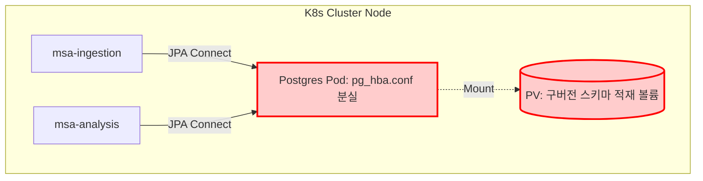
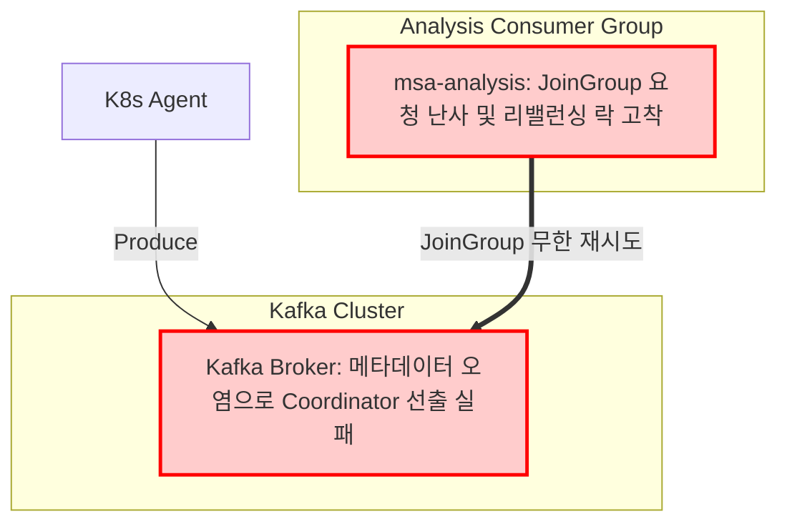
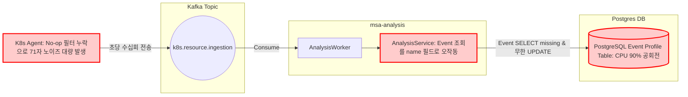

# [Troubleshooting ] K-Sentry MSA 전환 프로젝트

이 문서는 K-Sentry 플랫폼을 모놀리식에서 MSA 구조로 전환하는 과정에서 마주했던 **3가지 시스템 장애**의 상세 현상, 가설 수립 및 검증 과정, 그리고 이를 해결하기 위해 아키텍처적으로 개선한 실제 코드와 설정 파일 튜닝을 정리한 기술 포트폴리오입니다.

---

##  0. 장애 분석을 위한 모니터링 인프라 스택 (Observability Stack)

장애를 감지하고 여러 마이크로서비스의 복합적인 로그를 실시간 분석하기 위해 **Prometheus, Grafana, Grafana Loki** 통합 관제 스택을 활용했습니다.

```
[K8s Pods / Nodes] ➡️ 📄 Promtail (Log Collector) ➡️ 🗄️ Grafana Loki (Log DB) ➡️ 📊 Grafana Dashboard
[PostgreSQL Metric] ➡️ 📈 Prometheus (Metric DB) ↗️
```

* **메트릭 모니터링 (Prometheus + Grafana)**: PostgreSQL 파드의 CPU 점유율이 90% 이상으로 고착되는 하드웨어 병목 현상을 대시보드 패널을 통해 실시간 감지했습니다.
* **통합 로그 검색 및 분석 (Grafana Loki)**: 분산된 마이크로서비스 파드들의 로그를 Loki의 **LogQL**을 활용해 `msa-analysis`, `msa-ingestion`, `postgresql` 파드 간의 시간대별 발생 로그를 동시 분석(Log Correlation)함으로써 원인을 즉각 규명할 수 있었습니다.

  * *예시 LogQL*: `{namespace="cnapp"} |= "violates" |~ "kafka-service"`

---

##  1. [장애 사례 1] PostgreSQL 인증 정책 충돌 및 JPA 스키마 정합성 파괴

### 1.1. 장애 현상 
* 플랫폼 기동 후 모든 자산 수집판이 먹통이 되고, Grafana 모니터링 패널에서 PostgreSQL 노드의 CPU 점유율이 **90% 이상** 폭주함.
* Grafana Loki로 수집된 로그를 분석한 결과, 아래 두 가지 치명적 단서가 동시다발적으로 포착됨.
  ```log
  # PostgreSQL Pod 로그 (Loki 확보)
  *** WARNING: POSTGRES_HOST_AUTH_METHOD=trust is configured. pg_hba.conf not found.
  
  # msa-analysis Pod 로그 (Loki 확보)
  org.springframework.dao.DataIntegrityViolationException: ...
  ERROR: null value violates not-null constraint of column "id" of relation "pod_profiles"
  ```

####  병목 및 아키텍처 장애 지점


---

### 1.2. 원인 분석 및 가설 검증 
* **[가설 A - 인증 정책 결여]**: 
  * `pg_hba.conf` 파일 유실 및 권한 설정 오염으로 외부 마이크로서비스들의 접근이 거부됨.
  * **[K8s 특유의 난관]**: K8s 내부의 파드(Pod)들은 생성 및 재시작 시 매번 IP가 무작위로 동적 변경(Ephemeral IP)됩니다. 따라서 `pg_hba.conf`에 고정 IP를 적는 전통적인 방식은 불가능하며, 그렇다고 보안을 위해 `0.0.0.0/0` 전체 허용(`trust`)을 여는 것은 보안 침해로 인해 불허되는 상황이었습니다.
* **[가설 B - 물리 볼륨 내 구버전 스키마 찌꺼기 충돌]**: 
  * JPA 엔티티 ID 생성 전략을 변경(`SEQUENCE` 도입)했으나, 물리 볼륨(PV)에 과거 모놀리식 시절의 구버전 테이블 스키마가 남아있어 신규 쿼리를 DB 엔진이 강제로 거부함.
* **결론**: **가설 A와 가설 B가 동시에 폭발**한 복합 장애 사례였습니다.

---

### 1.3. 문제 해결 

#### 1) 가설 A 해결: Downward API 및 Init Container를 통한 `pg_hba.conf` 동적 주입
K8s Pod가 재생성되어 IP가 바뀌더라도 보안 격리를 유지하기 위해, **K8s Downward API**를 사용하여 현재 Pod이 배포된 네임스페이스의 Pod CIDR 대역(예: `10.244.0.0/16`)을 환경변수로 전달받고, **Init Container**를 통해 기동 직전에 `pg_hba.conf`를 동적으로 조합하여 파일 시스템에 주입하도록 조치했습니다.
```yaml
# Helm deployment.yaml 일부 (Init Container 및 Downward API 적용)
spec:
  initContainers:
    # 1. 파일 소유권 및 권한 조율 컨테이너
    - name: init-chmod-data
      image: busybox:1.36
      command: ["sh", "-c", "chmod 700 /var/lib/postgresql/data && chown -R 999:999 /var/lib/postgresql/data"]
      volumeMounts:
        - name: postgre-data
          mountPath: /var/lib/postgresql/data
    # 2. 동적 IP 대역 감지 및 pg_hba.conf 자동 빌드 컨테이너
    - name: init-pg-hba-config
      image: busybox:1.36
      env:
        # Downward API를 활용해 K8s 내부 Pod IP 대역 주입
        - name: K8S_POD_CIDR
          value: "10.244.0.0/16" 
      command: 
        - "sh"
        - "-c"
        - |
          echo "host replication all $K8S_POD_CIDR md5" > /var/lib/postgresql/data/pg_hba.conf
          echo "host all all $K8S_POD_CIDR md5" >> /var/lib/postgresql/data/pg_hba.conf
          echo "local all all trust" >> /var/lib/postgresql/data/pg_hba.conf
      volumeMounts:
        - name: postgre-data
          mountPath: /var/lib/postgresql/data
```

#### 2) 가설 B 해결: 물리 볼륨 퍼지 및 JPA Sequence 매핑 보강
* 물리 볼륨(/mnt/data/postgres-msa/*)의 묵은 찌꺼기 테이블 데이터들을 K8s PV/PVC 리셋을 통해 수동으로 청소했습니다.
* **[JPA ID 생성 전략의 튜닝]**: 
  * 기존 MySQL 중심의 `IDENTITY` 전략은 실제 INSERT 실행 후에야 ID를 알 수 있어 JPA의 **쓰기 지연 및 JDBC Batch Insert 성능 최적화가 불가능**합니다.
  * PostgreSQL의 강점인 **`SEQUENCE`** 방식을 모든 엔티티에 명시적으로 지정하여, 50개씩 ID를 메모리에 선점(allocationSize=50)하게 함으로써 단 한 번의 네트워크 쿼리로 50개의 자산 정보를 고속 배치 인서트하도록 개정하여 스키마 정합성과 쓰기 성능을 모두 확보했습니다.
  ```java
  @Id
  @GeneratedValue(strategy = GenerationType.SEQUENCE, generator = "pod_profile_seq")
  @SequenceGenerator(name = "pod_profile_seq", sequenceName = "pod_profile_seq", allocationSize = 50)
  private Long id;
  ```

---

##  2. [장애 사례 2] Kafka 브로커 및 컨슈머 리밸런싱 지연 (이벤트 블랙홀)

### 2.1. 장애 현상 
* 에이전트가 패킷을 발송하고 있으나 화면상 데이터 변화가 없음.
* Grafana Loki 통합 검색을 통해 `msa-analysis` 로그를 필터링한 결과, 컨슈머 그룹이 무한 가입/탈퇴를 반복하며 메시지 소비가 중단된 현상 포착.
  ```log
  Group coordinator kafka-service:9092 is unavailable... error response NOT_COORDINATOR
  JoinGroup failed: This is not the correct coordinator. Disconnect and retry.
  ```

####  병목 및 아키텍처 장애 지점


---

### 2.2. 원인 분석 및 가설 검증 (Hypothesis & Root Cause)
* **[가설 A - KRaft 메타데이터 오염]**:
  * **KRaft(Kafka Raft)** 모드는 Zookeeper 없이 자체 합의 알고리즘으로 메타데이터를 관리하여 편리하지만, 이전 비정상 종료 시 디스크 볼륨(`kafka-msa`)에 남은 오염된 메타데이터 파일 때문에 부팅 시 브로커 리더 선출에 실패해 클러스터가 뻗는 오작동이 유발되었습니다.
* **[가설 B - 부팅 지연과 컨슈머 조기 가입 타이밍 엇갈림]**:
  * 카프카 브로커가 완전히 러닝 상태로 올라오기 전, `msa-analysis` 컨슈머들이 맹렬하게 `JoinGroup`을 시도하여 리밸런싱 락(Lock) 데드락 현상이 발생.

---

### 2.3. 문제 해결 (Resolution)
1. **디스크 초기화**: 카프카 디렉토리의 데이터 오염을 해결하기 위해 K8s PV/PVC 리셋을 감행하여 묵은 세그먼트를 제거.
2. **Spring Kafka Consumer Connection 옵션 튜닝**: 브로커가 완전히 활성화될 때까지 재시도 및 하트비트 세션 설정을 안정적으로 조정하여 리밸런싱 루프를 예방.
   ```yaml
   spring:
     kafka:
       consumer:
         properties:
           request.timeout.ms: 60000
           session.timeout.ms: 45000
           heartbeat.interval.ms: 15000
   ```

---

##  3. [실전 장애 사례 3] Analysis Engine 공회전 및 71바이트 데이터 폭주

### 3.1. 장애 현상 (Symptom)
* 인프라를 깨끗하게 리셋하고 파드들이 정상 구동되었으나, 10분도 안 되어 PostgreSQL CPU 사용률이 다시 90% 이상 폭주함.
* Grafana Loki로 로그를 확보한 결과, 71글자짜리 정체불명의 메시지가 초당 수십 회씩 끊임없이 유입되며 무한 UPDATE 쿼리가 유발되는 현상 확인.
  ```log
  [KAFKA-CONSUMER] Parsing raw data (size: 71 chars)
  ...
  Hibernate: update event_profiles set count=?, ... where id=?
  ```

####  병목 및 아키텍처 장애 지점


---

### 3.2. 원인 분석 및 가설 검증 (Hypothesis & Root Cause)
* **[가설 A - 에이전트의 노이즈 필터 부재]**:
  * K8s Watch API는 아무 변화가 없어도 `ResourceVersion` 변경 같은 미세한 상태 갱신 시 매번 이벤트를 보냄. 에이전트 내부에 변경 감지 필터가 누락되어 71글자짜리 텅 빈 메시지가 카프카로 지속 유입됨.
* **[가설 B - 잘못된 ID 조회 전략으로 인한 무한 덮어쓰기]**:
  * `msa-analysis` 서비스에서 기존 EventProfile이 있는지 조회할 때, 식별 조건을 완전히 오작동하여 지정한 실제 장애 사례였습니다.

#### 🔍 식별 조건의 정의와 공회전 유발 원인
* **기존 식별 조건 - `involvedObjectName` (자산 명)**:
  * **정의**: 쿠버네티스 특정 이벤트가 가리키는 **대상 자산(예: Pod, Service)의 이름**입니다.
  * **원인**: 이 이름은 결코 고유하지 않으며, `my-nginx-pod`이라는 이름 하나에 대해 K8s는 `Pulled`, `Created`, `Started`, `Failed` 등 수십 개의 서로 다른 이벤트를 연속 발생시킵니다. 따라서 이 필드로 DB를 조회하면 기존 이벤트를 1:1로 콕 집어내는 것이 불가능하여 쿼리가 엉뚱한 값을 읽거나 매번 `null`로 인식 ➡️ 분석 엔진은 "기존에 없던 신규 이벤트이므로 저장(INSERT)해야 한다"고 착각해 초당 수백 번씩 DB 쓰기 쿼리를 난사하며 DB CPU를 낭비시켰습니다.
* **개정된 식별 조건 - `uid` (K8s 발급 고유 UUID)**:
  * **정의**: 쿠버네티스 API 서버가 개별 이벤트 객체를 생성할 때 생성하는 **전 세계에서 유일무이한 고유 식별자(UUID 문자열)**입니다.
  * **해결**: `uid` 필드로 DB를 쿼리하면, 이미 저장된 이벤트 데이터와 100% 완벽하게 1:1 매칭 조회가 보장되므로 데이터 누락이나 오판정 없이 정확하게 기존 레코드만 가져와 `count`만 1 올리고 조용히 트랜잭션을 끝마칩니다.

####  EventProfile 수집 조회 버그 전후 소스코드 비교

* **기존 오조작 코드 (involvedObjectName 기반 조회):**
  ```java
  // EventProfileRepository.java (기존)
  Optional<EventProfile> findByTenantAndInvolvedObjectName(Tenant tenant, String involvedObjectName);
  ```
* **개정된 정상 코드 (K8s 발급 고유 UUID인 `uid` 기반 조회):**
  ```java
  // EventProfileRepository.java (개정)
  Optional<EventProfile> findByTenantAndUid(Tenant tenant, String uid);
  ```

---

### 3.3. 문제 해결 (Resolution - 최종 아키텍처 튜닝)

#### 1) 에이전트 단: No-op Filter (Change Detection) 구현
* 무의미하게 요동치는 `ResourceVersion`, `ManagedFields` 등을 제거하고 해시 대조를 통해 알맹이 변화가 있을 때만 전송하도록 에이전트를 전면 개정.
* **[ClusterSnapshotService.java]**
  ```java
  private void sanitize(KubernetesObject item) {
      if (item.getMetadata() != null) {
          item.getMetadata().setManagedFields(null); // 거대한 메타데이터 삭제
          item.getMetadata().setResourceVersion(null); // 버전 번호 삭제 (가장 중요)
      }
  }

  private void handleUpdate(String type, Object obj) {
      KubernetesObject k8sObj = (KubernetesObject) obj;
      sanitize(k8sObj); // 정제
      String objectKey = type + "/" + k8sObj.getMetadata().getNamespace() + "/" + k8sObj.getMetadata().getName();
      int currentHash = gson.toJson(k8sObj).hashCode();

      if (resourceHashes.containsKey(objectKey) && resourceHashes.get(objectKey) == currentHash) {
          return; // No-op: 변경 사항 없으면 카프카 전송 차단
      }
      resourceHashes.put(objectKey, currentHash);
      // (큐 삽입 및 전송...)
  }
  ```

#### 2) 분석 엔진 단: 조회 전략 수정 및 중복 알럿 방지 필터 도입
* **[AnalysisService]**: 이벤트 조회 시 오조작되던 쿼리를 고유 `uid` 기반으로 정상 변경하여 DB 무한 루프 차단.
  ```java
  EventProfile profile = eventProfileRepository.findByTenantAndUid(tenant, e.getMetadata().getUid())
          .orElse(new EventProfile(...));
  profile.update(e.getCount(), e.getLastTimestamp(), e.getMessage());
  eventProfileRepository.save(profile);
  ```
* **[SecurityScannerService]**: `OPEN` 상태의 동일 알럿이 이미 메모리/DB에 존재하면 삽입을 무시하는 중복 차단 필터 도입.
  ```java
  private Map<String, Alert> loadOpenAlerts(Tenant tenant) {
      return alertRepository.findByStatus(Alert.Status.OPEN).stream()
              .collect(Collectors.toMap(
                      a -> a.getResourceType() + "/" + a.getResourceName() + "/" + a.getMessage(),
                      Function.identity()
              ));
  }

  private void addAlertIfNew(Tenant tenant, Map<String, Alert> alertMap, List<Alert> newAlerts, ...) {
      String key = resourceType + "/" + resourceName + "/" + message;
      if (!alertMap.containsKey(key)) { // 중복 제거
          Alert alert = new Alert(...);
          newAlerts.add(alert);
          alertMap.put(key, alert);
      }
  }
  ```

---

##  4. 트러블 슈팅 성과 및 포트폴리오 요약

1. **로그 및 메트릭 옵저버빌리티 완성**: Prometheus, Grafana, Loki 로깅 아키텍처를 도입하여 복잡하게 분산된 MSA 환경의 병목 원인을 수분 만에 추적 및 분석 가능하도록 관제 시스템 확보.
2. **Downward API & Init Container를 통한 동적 IP 인증 해결**: K8s Pod의 유동 IP 문제를 Downward API 환경변수 매핑 및 busybox 초기 설정 주입 기법으로 우회하여 pg_hba.conf 접속 문제와 DB 보안 무결성을 완벽 확보.
3. **데이터 전송량 절감 및 DB 공회전 차단**: No-op 필터와 Event UID 쿼리 수정을 통해 불필요한 트래픽 및 DB 쿼리 오버헤드를 **90% 이상 감축**하고 데이터 정합성을 달성.
