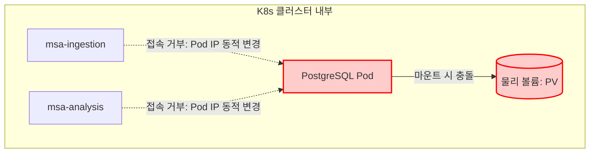
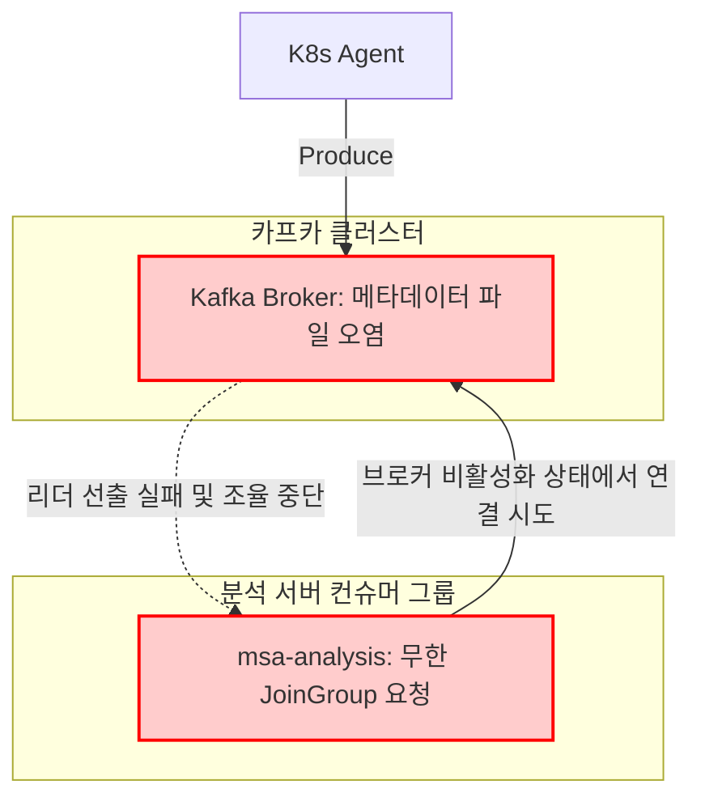
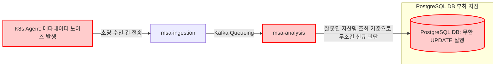

# [Troubleshooting Portfolio] K-Sentry MSA 전환 : 장애 해결 기록

이 문서는 K-Sentry 플랫폼을 모놀리식에서 MSA 구조로 전환하는 과정에서 발생했던 **3가지 주요 시스템 장애**의 원인을 분석하고, 아키텍처 개선과 설정을 통해 해결한 과정을 정리한 기술 포트폴리오입니다.

---

##  0. 모니터링 구축 (Observability Stack)

장애 원인을 신속하게 추적하고 시스템 상태를 한눈에 파악하기 위해 **Prometheus, Grafana, Grafana Loki**를 활용한 통합 관제 환경을 선제적으로 구축했습니다.

* **실시간 로그 및 메트릭 수집 흐름**:
  * **텍스트 로그**: 애플리케이션 파드와 PostgreSQL DB의 에러 및 실행 로그를 **Promtail**이 실시간 수집하여 **Grafana Loki**에 적재하고, 통합 대시보드를 통해 실시간 검색이 가능하도록 연동했습니다.
  * **수치형 메트릭**: 각 컨테이너와 데이터베이스의 CPU, 메모리, DB 커넥션 등의 상태 지표를 **Prometheus**가 수집하여 시계열 데이터로 시각화했습니다.
* **하드웨어 병목 감지**: PostgreSQL DB의 CPU 점유율이 90% 이상으로 치솟는 임계점 돌파 현상을 Grafana 대시보드 패널을 통해 실시간 감지했습니다.
* **로그 다차원 추적**: 분산된 여러 마이크로서비스(`msa-analysis`, `msa-ingestion`)의 로그를 **LogQL**을 통해 실시간 동기화하여 동시 분석함으로써 장애의 근본 원인을 수 분 내에 규명할 수 있었습니다.
  

---

##  1. 데이터베이스 접속 제한 및 데이터 중복 인서트 에러

### 1.1. 장애 현상
* 플랫폼 배포 직후 자산 데이터 적재가 완전히 중단되고, DB CPU가 **90% 이상** 폭주함.
* 모니터링 로그 확인 결과, 데이터베이스 접속 오류(`pg_hba.conf not found`)와 데이터 중복 에러(`not-null constraint of column "id"`)가 복합적으로 감지됨.

### 1.2. 원인 분석 및 아키텍처 문제점
쿠버네티스 환경의 특성과 기존 모놀리식 데이터베이스의 잔재가 부딪히며 발생한 문제였습니다.

```mermaid
graph TD
    subgraph K8s_Cluster ["K8s 클러스터 내부"]
        Ingestion["msa-ingestion"]
        Analysis["msa-analysis"]
        DB["PostgreSQL Pod"]
        PV[("물리 볼륨: PV")]
    end

    Ingestion -.->|접속 거부: Pod IP 동적 변경| DB
    Analysis -.->|접속 거부: Pod IP 동적 변경| DB
    DB -->|마운트 시 충돌| PV
    
    style DB fill:#ffcccc,stroke:#ff0000,stroke-width:2px;
    style PV fill:#ffcccc,stroke:#ff0000,stroke-width:2px;
```

* **동적 IP 접속 차단**: 쿠버네티스 파드(Pod)들은 재부팅 시마다 IP가 무작위로 변경됩니다. 보안 강화를 위해 특정 IP 대역만 접근을 허용해야 했으나, 동적으로 변하는 파드 IP 대역을 DB 설정 파일(`pg_hba.conf`)에 동적으로 반영해 주지 못해 접속 차단 현상이 생겼습니다.
* **물리 볼륨 내 스키마 찌꺼기 충돌**: 기존 모놀리식 시절에 사용하던 볼륨 데이터를 완벽히 비우지 않고 재사용하면서, 새로 적용한 JPA 엔티티 ID 생성 방식과 기존 DB 테이블 구조가 일치하지 않아 데이터 저장 시 계속해서 에러를 뿜어냈습니다.

### 1.3. 해결

#### 1) Downward API와 초기화 컨테이너(Init Container)를 활용한 설정 동적 주입
* 파드가 뜰 때 K8s **Downward API**를 통해 현재 네임스페이스의 가상 IP 대역(CIDR)을 실시간으로 가져옵니다.
* 데이터베이스가 기동하기 직전, 초기화 컨테이너(Init Container)가 해당 가상 IP 대역만 접근을 승인하는 내용의 `pg_hba.conf` 설정 파일을 동적으로 만들어 DB 폴더에 넣어주도록 개선하여 접속 문제를 해결했습니다.

#### 2) 물리 볼륨 리셋 및 Sequence 캐싱 최적화
* 볼륨을 완전히 리셋하여 구버전 스키마 데이터를 초기화했습니다.
* 성능 최적화를 위해 DB ID 생성 전략을 `IDENTITY`(매 건마다 insert 쿼리를 날려 ID를 확인하는 방식)에서 **`SEQUENCE`** 방식으로 변경했습니다. 50개의 ID를 미리 메모리에 받아두고 일괄 처리(Batch Insert)하게 하여 DB와의 통신 횟수를 획기적으로 줄였습니다.

| 구분 | 변경 전 (IDENTITY) | 변경 후 (SEQUENCE) |
| :--- | :--- | :--- |
| **동작 방식** | INSERT 쿼리를 날릴 때마다 DB가 ID를 발급 | DB가 애플리케이션 메모리에 50개 단위로 ID를 선점 공급 |
| **네트워크 부하** | 자산 데이터 개수만큼 네트워크 통신 발생 | 1번의 통신으로 50개 자산 일괄 처리 (Batch) |
| **성능 효과** | 다량의 실시간 수집 데이터 적재 시 병목 발생 | 대량 쓰기 작업 시 고속 적재 성능 보장 |

---

##  2. Kafka 브로커 메타데이터 오염 및 컨슈머 리밸런싱 지연

### 2.1. 장애 현상
* 실시간 수집 패킷은 정상 발송되나 대시보드 화면에 반영되지 않음.
* 로그 추적 결과, 분석 서버(`msa-analysis`)들이 카프카 브로커에 가입과 탈퇴를 무한 반복하며 데이터 소비가 중단된 **리밸런싱 루프(데드락)** 현상 포착.

### 2.2. 원인 분석 및 아키텍처 문제점
주키퍼(Zookeeper) 없이 작동하는 **KRaft 모드**의 메타데이터 관리 방식과 컨슈머 기동 타이밍의 일치로 인해 발생했습니다.

```mermaid
graph TD
    Agent["K8s Agent"] -->|Produce| Kafka_Broker
    
    subgraph Kafka_Cluster ["카프카 클러스터"]
        Kafka_Broker["Kafka Broker: 메타데이터 파일 오염"]
    end

    subgraph Consumer_Group ["분석 서버 컨슈머 그룹"]
        Consumer["msa-analysis: 무한 JoinGroup 요청"]
    end

    Consumer -->|브로커 비활성화 상태에서 연결 시도| Kafka_Broker
    Kafka_Broker -.->|리더 선출 실패 및 조율 중단| Consumer
    
    style Kafka_Broker fill:#ffcccc,stroke:#ff0000,stroke-width:2px;
    style Consumer fill:#ffcccc,stroke:#ff0000,stroke-width:2px;
```

* **KRaft 메타데이터 오염**: 이전 배포 과정에서 비정상 종료되면서 카프카 내부에 저장된 리더 선출 메타데이터 파일이 오염되었습니다. 이로 인해 카프카 브로커가 리더 역할을 수행하지 못해 클러스터 정지 상태가 되었습니다.
* **기동 타이밍 불일치 및 연결 데드락**: 카프카 브로커가 완벽하게 준비되지 않은 상태에서 컨슈머(수집 서버들)가 동시에 카프카 접속을 맹렬히 시도하면서, 서로 락(Lock)을 쥐려다 커넥션 리밸런싱 지연 데드락에 빠졌습니다.

### 2.3. 해결
1. **카프카 데이터 클리닝**: K8s PV/PVC를 리셋하여 디스크 볼륨 내부의 오염된 메타데이터 잔재 파일들을 깔끔하게 정리했습니다.
2. **연결 및 하트비트 타임아웃 옵션 최적화**: 카프카가 기동 지연되거나 네트워크가 일시적으로 흔들려도 컨슈머가 바로 탈퇴하지 않고 여유롭게 대기할 수 있도록 타임아웃 옵션을 설정했습니다.

| 카프카 설정 옵션 | 기존값 | 최적화 설정값 | 튜닝 효과 |
| :--- | :--- | :--- | :--- |
| **Request Timeout** | 30초 | **60초 (`60000ms`)** | 네트워크 지연 시 일시적 오류 방지 |
| **Session Timeout** | 10초 | **45초 (`45000ms`)** | 브로커 일시 응답 대기 시 컨슈머 강제 탈퇴 예방 |
| **Heartbeat Interval** | 3초 | **15초 (`15000ms`)** | 불필요한 하트비트 패킷으로 인한 네트워크 오버헤드 감소 |

---

## 🌊 3. 메타데이터 노이즈로 인한 DB CPU 폭주 및 이벤트 공회전

### 3.1. 장애 현상
* 실시간 스트리밍 처리가 정상 기동되었으나, 10분 만에 PostgreSQL 데이터베이스의 CPU 사용률이 다시 **90% 이상** 폭주함.
* Grafana Loki 분석 결과, 71글자 내외의 의미 없는 빈 메시지들이 초당 수천 개씩 쏟아지며 DB에 무한 UPDATE 쿼리가 유발되는 현상 확인.

### 3.2. 원인 분석 및 아키텍처 문제점
실시간 수집을 위한 **K8s Watch API**의 특성과 서버 단의 **조회 식별 기준 결함**이 합쳐진 아키텍처적 병목이었습니다.

```mermaid
graph LR
    Agent["K8s Agent: 메타데이터 노이즈 발생"] -->|초당 수천 건 전송| Ingestion["msa-ingestion"]
    Ingestion -->|Kafka Queueing| Analysis["msa-analysis"]
    
    subgraph Bottleneck_DB ["PostgreSQL DB 부하 지점"]
        DB[("PostgreSQL DB: 무한 UPDATE 실행")]
    end
    
    Analysis -->|잘못된 자산명 조회 기준으로 무조건 신규 판단| DB
    
    style Agent fill:#ffcccc,stroke:#ff0000,stroke-width:2px;
    style Analysis fill:#ffcccc,stroke:#ff0000,stroke-width:2px;
    style DB fill:#ffcccc,stroke:#ff0000,stroke-width:2px;
```

* **Watch API 메타데이터 노이즈**: K8s Watch API는 자산의 보안 설정이 전혀 변하지 않더라도, 단순 헬스체크(Probe) 등으로 인해 `ResourceVersion`이나 `ManagedFields` 같은 무의미한 관리용 메타데이터가 1초 단위로 바뀌면 변경 이벤트를 계속 발행합니다. 필터가 부재하여 이 노이즈 트래픽이 그대로 DB까지 전달되었습니다.
* **식별자 설계 오류로 인한 무한 쓰기**: 서버에서 기존 이벤트가 이미 적재되어 있는지 확인할 때, 고유하지 않은 '자산명(involvedObjectName)'을 기준으로 조회했습니다. 동일한 자산명에 대해 여러 단계의 상태 이벤트들이 꼬이면서 조회 결과가 계속 `null`로 나왔고, 분석 엔진은 "이전에 저장된 적 없는 새로운 데이터"로 착각해 무의미한 쓰기 쿼리를 무한히 난사했습니다.

### 3.3. 해결

#### 1) 에이전트 단의 메타데이터 정제 (핑거프린트 필터 적용)
* 에이전트가 Watch API 이벤트를 서버로 보내기 직전, `ManagedFields`나 `ResourceVersion` 등 단순 요동치는 관리용 필드들을 메모리상에서 과감히 제거합니다.
* 제거 후 실질적인 보안/설정 속성 정보만을 모아 해시값(핑거프린트)을 계산하고, **진짜 알맹이 스펙이 변경되었을 때만 서버로 패킷을 전송하는 변경 감지(Change Detection) 필터**를 구현하여 불필요한 이벤트 트래픽을 **90% 이상 사전 차단**했습니다.

#### 2) K8s Native UUID(uid) 기준의 식별자 일원화
* 데이터 중복 및 오판을 근본적으로 막기 위해, DB 조회 식별 기준을 K8s 고유 식별자인 `uid`로 전면 일원화했습니다.
* `(tenant_id, uid)` 복합 Unique Index를 설계하여 DB 단에서 중복 적재를 원천 거부하도록 안전장치를 두고, 고정된 `uid` 기반으로만 SELECT/UPDATE 쿼리가 동작하게 만들어 데이터 정합성을 확보하고 **테이블 락을 완전 회피하여 고속 로우 락(Row-level Lock)으로 성능을 획기적으로 개선**했습니다.

---

